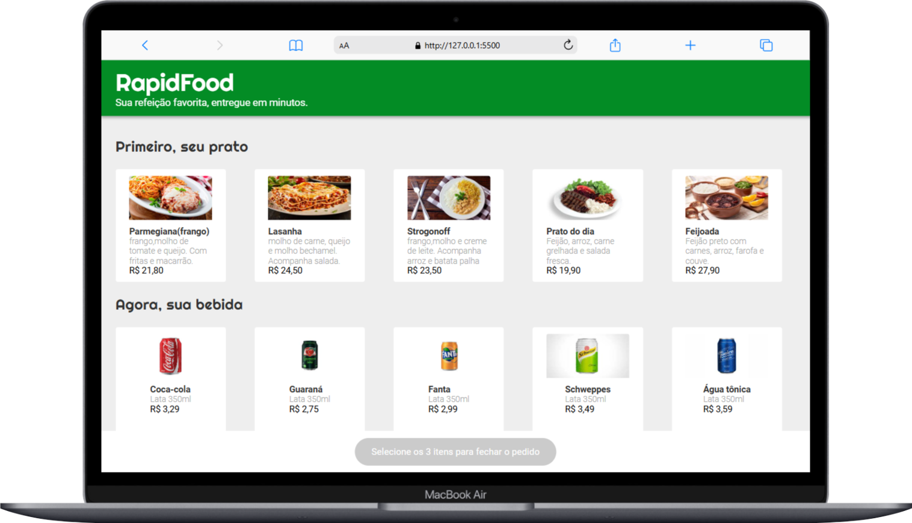

# Projeto de app de comida: RapidFood 🍽️

📜 **Descrição**  
Bem-vindo ao **RapidFood**! Este é um projeto de uma página interativa onde o usuário pode escolher entre várias opções de **comida**, **sobremesa** e **bebida**. Ao finalizar o pedido, o usuário visualiza um resumo com o valor total e é redirecionado automaticamente para o WhatsApp, onde pode confirmar e finalizar a compra.

O objetivo desse projeto é criar uma interface simples e funcional para que o usuário possa fazer seu pedido de forma rápida e prática.

🎨 **Layout Fornecido**  
O design foi desenvolvido com foco na simplicidade e funcionalidade. A página é responsiva, adaptando-se bem a dispositivos móveis e desktops, oferecendo uma experiência de navegação fluida e agradável.



🛠️ **Tecnologias Utilizadas**  
Neste projeto, utilizei as seguintes tecnologias para criar uma experiência interativa e prática:

- **HTML**: Estrutura básica da página.
- **CSS**: Para estilizar a página, proporcionando uma aparência visual atraente.
- **JavaScript**: Implementação da lógica de interação, controle das escolhas e cálculo do valor total do pedido.
- **WhatsApp Link**: O link para o WhatsApp é gerado dinamicamente utilizando **JavaScript**, facilitando o envio de uma mensagem com o pedido pronto para o usuário confirmar.

⚙️ **Funcionalidades**

- **Escolha de Itens**: O usuário pode selecionar opções de **comida**, **sobremesa** e **bebida**.
- **Cálculo Automático**: O valor total do pedido é calculado automaticamente conforme as opções selecionadas.
- **Resumo do Pedido**: Após a seleção, o usuário vê um resumo com os itens escolhidos e o valor total.
- **Link para WhatsApp**: Ao clicar no botão "Finalizar Pedido", o usuário é redirecionado para o WhatsApp com uma mensagem pré-preenchida com os detalhes do pedido.

📱 **Como Usar**

1. Clone o repositório em sua máquina local ou baixe o código-fonte:

   ```bash
   git clone https://github.com/Claudiannyy/RapidFood.git
   ```

2. Abra o arquivo `index.html` no seu navegador para visualizar a página.

3. Selecione as opções de comida, sobremesa e bebida.

4. O resumo do pedido será exibido, incluindo o valor total. Ao clicar em "Finalizar Pedido", o usuário será redirecionado para o WhatsApp com o pedido pré-preenchido.

🔧 **Personalização**  
Este projeto é fácil de personalizar para atender a diferentes necessidades. Aqui estão algumas maneiras de ajustar o código:

- **Adicionar mais opções**: Edite as listas de opções de comida, sobremesa e bebida diretamente no arquivo `index.html`.
- **Alterar preços**: Ajuste os preços dos itens no arquivo `script.js` para refletir os valores desejados.
- **Alterar o link do WhatsApp**: O link para o WhatsApp é gerado dinamicamente no JavaScript. Você pode modificar o texto da mensagem conforme necessário.
